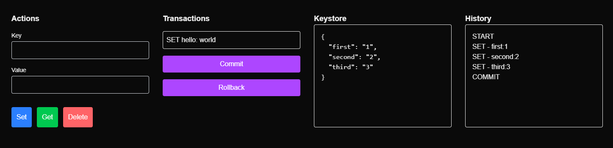

## Instructions

For this project to work correctly, you will need to have the following:
- NodeJS ([v23.3.0 prefered](https://nodejs.org/en/download))
- Postgres (https://www.postgresql.org/download/)
- Create a `.env` file in the root folder of the project

Once Node is installed, install dependencies with npm:
```bash
npm install
```

## Database Setup

Add the following to your `.env` file, make sure to replace username, password, and port.
```
DATABASE_URL='postgresql://<username>:<password>@localhost:<port>/keystore'
```

Make sure that this database exist in your postgres! If it does not, create one.
We need to setup Prisma so that it can connect to our postgres DB.

```bash
npx prisma generate
```

To start the server
```bash
npm run dev
```

Go to `localhost:3000/ping` to verify that the server is running.

Go to `localhost:3000/keystore` to preview the keystore page.

You should see something like this:


## Additional Database Configuration Notes

If you need to update the schema, modify the `schema.primsa` file.
Then run the following command to update.

```bash
npx prisma migrate dev --name <migration_message>
```

If you want to start fresh.

```bash
npx prisma init
```

Paste the following into the schema file.

```
generator client {
  provider = "prisma-client-js"
}

datasource db {
  provider = "postgresql"  // Change provider to PostgreSQL
  url      = env("DATABASE_URL")  // Ensure this is updated with your PostgreSQL connection URL
}

model Action {
  id      Int      @id @default(autoincrement()) // Use auto-incrementing integer ID
  action  String
  key     String?  // Optional field
  value   Json?    // Optional field
  created DateTime @default(now())
}
```

```bash
npx prisma generate
npm run dev
```